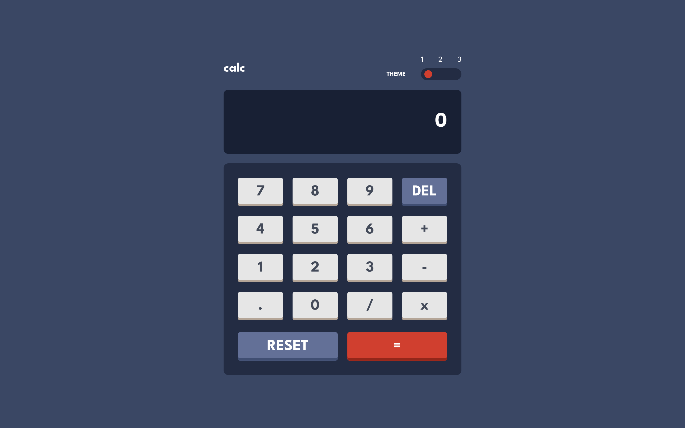
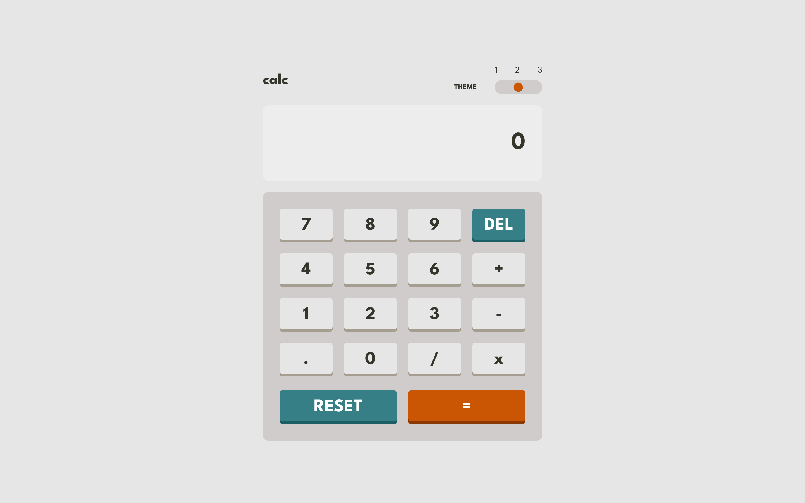
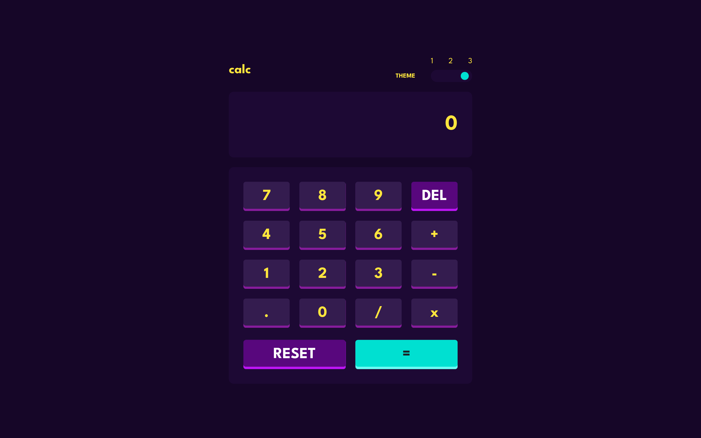
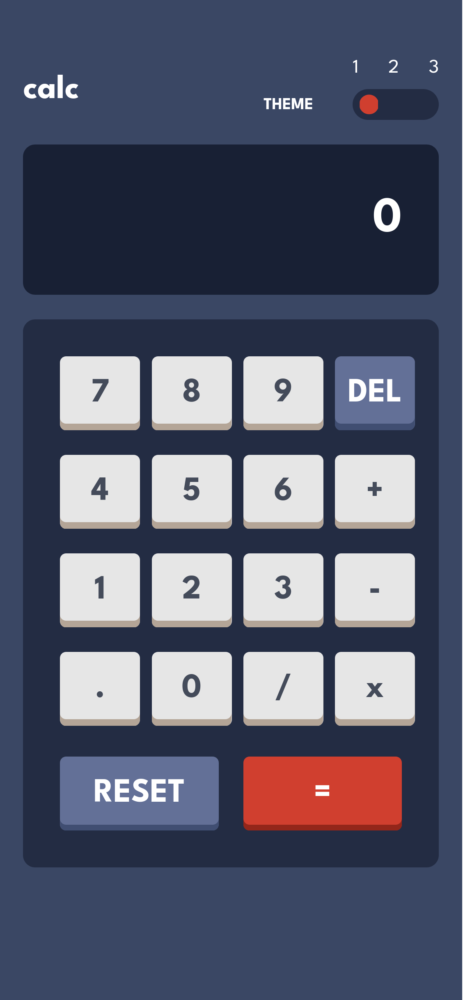
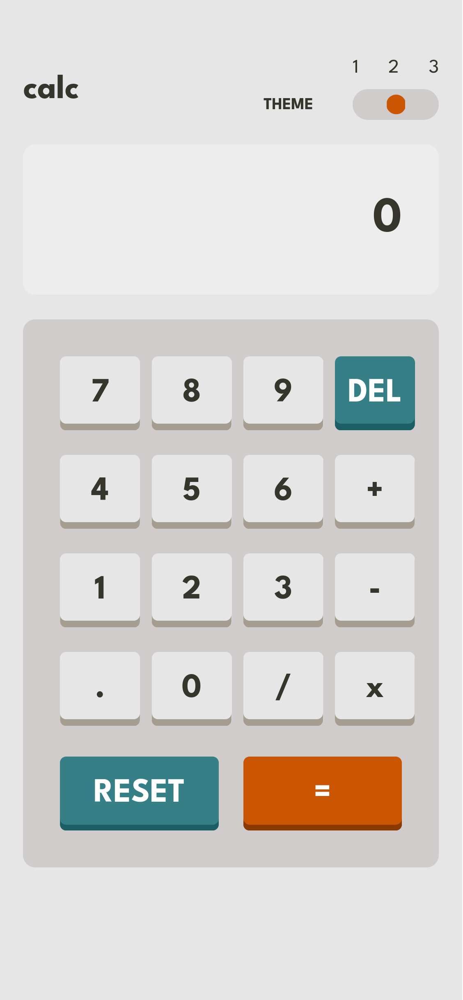
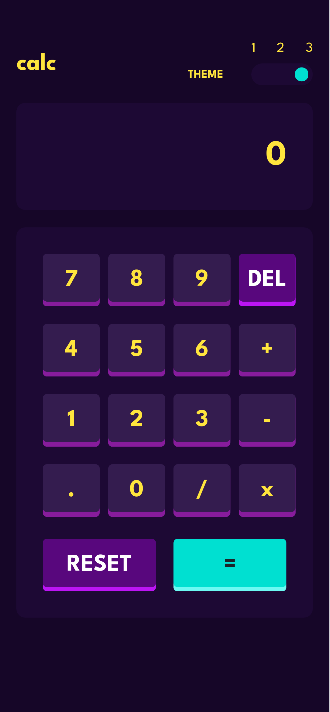

# Calculator Web App

A web app calculator built using HTML, CSS and Typescript to evaluate any mathematical expression including the four main operations: addition, subtraction, multiplication and division.

It implements a theme switcher allowing to choose between three different themes, being the choosen one by the user saved for future usages of the application.

## Featues

- Three different color themes available.

- User preferences being saved on browser storage, loaded on every time the user enters the application, never losting its previous configurations.

- shortcuts for the calculator operations, being the user able to inserting, cleaning and deleting characters from the calculator screen using his keyboard.

## Keyboard Shortcuts

### Insert digits on calculator screen

Just press any numeric key to insert numbers and one of the keys below to insert operators characters:

`*` Insert the multiplication operator
`/` Insert the division operator
`+` Insert the addition operator
`-` Insert the subtraction operator
`.` Insert the dot character

### Remove an character from the calculator screen

The shortcut for this action is the `Del` key or the `Backspace` key.

### Clean the calculator screen

To remove all character on calculator screen, setting its value to zero `0`, press the `Esc` key.

### Evaluating a mathematical expression

To display on the calculator screen the result of the mathematical expression on it, press the `Enter` key or the `=` key.

## Themes

### Desktop

#### Dark

#### Light

#### Purple

### Mobile

#### Dark

#### Light

#### Purple

